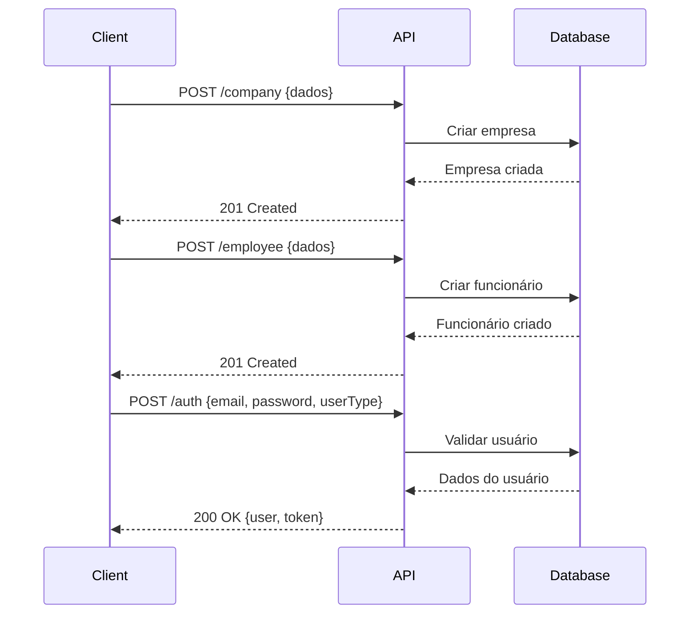
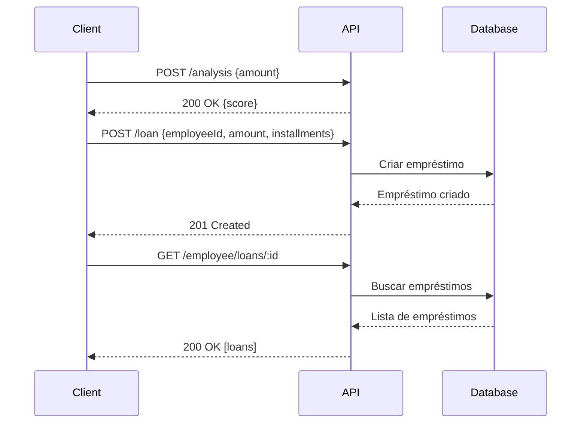

# 🚀 API Design - Credifit

Documentação completa da API REST para simulação de empréstimos consignados.

## 📋 Informações Gerais

### Base URL
```
http://localhost:3000
```

### Documentação Interativa
```
http://localhost:3000/api
```

### Autenticação
- **Tipo:** Bearer Token (JWT)
- **Header:** `Authorization: Bearer {token}`
- **Duração:** Configurável via JWT_SECRET

### Content-Type
```
Content-Type: application/json
```

## 🔐 Autenticação

### POST /auth
Autentica usuário e retorna token JWT.

**Request:**
```json
{
  "email": "usuario@exemplo.com",
  "password": "senha123",
  "userType": "employee" // ou "company"
}
```

**Response (200 OK):**
```json
{
  "user": {
    "id": 1,
    "name": "João Silva",
    "email": "joao@exemplo.com",
    "userType": "employee"
  },
  "token": "eyJhbGciOiJIUzI1NiIsInR5cCI6IkpXVCJ9..."
}
```

**Response (404 Not Found):**
```json
{
  "message": "Email ou senha inválidos.",
  "error": "Not Found",
  "statusCode": 404
}
```

**Response (401 Unauthorized):**
```json
{
  "message": "Email ou senha inválidos.",
  "error": "Unauthorized",
  "statusCode": 401
}
```

## 🏢 Empresas (Companies)

### POST /company
Cria uma nova empresa.

**Request:**
```json
{
  "name": "Empresa Exemplo LTDA",
  "razaoSocial": "Empresa Exemplo Sociedade Limitada",
  "email": "contato@empresa.com",
  "password": "senha123",
  "cnpj": "12345678000199"
}
```

**Response (201 Created):**
```json
{
  "id": 1,
  "name": "Empresa Exemplo LTDA",
  "razaoSocial": "Empresa Exemplo Sociedade Limitada",
  "email": "contato@empresa.com",
  "cnpj": "12345678000199",
  "createdAt": "2024-01-08T10:00:00.000Z",
  "updatedAt": "2024-01-08T10:00:00.000Z"
}
```

**Response (409 Conflict):**
```json
{
  "message": "Uma empresa com este CNPJ já existe.",
  "error": "Conflict",
  "statusCode": 409
}
```

### GET /company
Lista todas as empresas. **[Protegida]**

**Headers:**
```
Authorization: Bearer {token}
```

**Response (200 OK):**
```json
[
  {
    "id": 1,
    "name": "Empresa Exemplo LTDA",
    "razaoSocial": "Empresa Exemplo Sociedade Limitada",
    "email": "contato@empresa.com",
    "cnpj": "12345678000199",
    "createdAt": "2024-01-08T10:00:00.000Z",
    "updatedAt": "2024-01-08T10:00:00.000Z"
  }
]
```

### GET /company/:id
Busca uma empresa por ID. **[Protegida]**

**Headers:**
```
Authorization: Bearer {token}
```

**Response (200 OK):**
```json
{
  "id": 1,
  "name": "Empresa Exemplo LTDA",
  "razaoSocial": "Empresa Exemplo Sociedade Limitada",
  "email": "contato@empresa.com",
  "cnpj": "12345678000199",
  "createdAt": "2024-01-08T10:00:00.000Z",
  "updatedAt": "2024-01-08T10:00:00.000Z"
}
```

**Response (404 Not Found):**
```json
{
  "message": "Empresa com ID 999 não encontrada.",
  "error": "Not Found",
  "statusCode": 404
}
```

### PATCH /company/:id
Atualiza uma empresa. **[Protegida]**

**Headers:**
```
Authorization: Bearer {token}
```

**Request:**
```json
{
  "name": "Novo Nome da Empresa",
  "email": "novo@email.com"
}
```

**Response (200 OK):**
```json
{
  "id": 1,
  "name": "Novo Nome da Empresa",
  "razaoSocial": "Empresa Exemplo Sociedade Limitada",
  "email": "novo@email.com",
  "cnpj": "12345678000199",
  "createdAt": "2024-01-08T10:00:00.000Z",
  "updatedAt": "2024-01-08T11:00:00.000Z"
}
```

### DELETE /company/:id
Remove uma empresa. **[Protegida]**

**Headers:**
```
Authorization: Bearer {token}
```

**Response (200 OK):**
```json
{
  "message": "Empresa com ID 1 removida com sucesso."
}
```

## 👥 Funcionários (Employees)

### POST /employee
Cria um novo funcionário.

**Request:**
```json
{
  "name": "João da Silva",
  "cpf": "12345678901",
  "email": "joao@exemplo.com",
  "password": "senha123",
  "salary": 5000.00,
  "companyCnpj": "12345678000199"
}
```

**Response (201 Created):**
```json
{
  "id": 1,
  "name": "João da Silva",
  "cpf": "12345678901",
  "email": "joao@exemplo.com",
  "salary": 5000.00,
  "companyId": 1,
  "createdAt": "2024-01-08T10:00:00.000Z",
  "updatedAt": "2024-01-08T10:00:00.000Z"
}
```

**Response (409 Conflict):**
```json
{
  "message": "Funcionário com CPF 12345678901 já cadastrado.",
  "error": "Conflict",
  "statusCode": 409
}
```

**Response (404 Not Found):**
```json
{
  "message": "Empresa com CNPJ 12345678000199 não encontrada.",
  "error": "Not Found",
  "statusCode": 404
}
```

### GET /employee
Lista todos os funcionários. **[Protegida]**

**Headers:**
```
Authorization: Bearer {token}
```

**Response (200 OK):**
```json
[
  {
    "id": 1,
    "name": "João da Silva",
    "cpf": "12345678901",
    "email": "joao@exemplo.com",
    "salary": 5000.00,
    "companyId": 1,
    "createdAt": "2024-01-08T10:00:00.000Z",
    "updatedAt": "2024-01-08T10:00:00.000Z"
  }
]
```

### GET /employee/:id
Busca um funcionário por ID. **[Protegida]**

**Headers:**
```
Authorization: Bearer {token}
```

**Response (200 OK):**
```json
{
  "id": 1,
  "name": "João da Silva",
  "cpf": "12345678901",
  "email": "joao@exemplo.com",
  "salary": 5000.00,
  "companyId": 1,
  "createdAt": "2024-01-08T10:00:00.000Z",
  "updatedAt": "2024-01-08T10:00:00.000Z"
}
```

### GET /employee/loans/:id
Lista empréstimos de um funcionário. **[Protegida]**

**Headers:**
```
Authorization: Bearer {token}
```

**Response (200 OK):**
```json
[
  {
    "id": 1,
    "employeeId": 1,
    "value": 10000.00,
    "installments": 12,
    "status": "PENDING",
    "createdAt": "2024-01-08T10:00:00.000Z",
    "updatedAt": "2024-01-08T10:00:00.000Z"
  }
]
```

### PATCH /employee/:id
Atualiza um funcionário. **[Protegida]**

**Headers:**
```
Authorization: Bearer {token}
```

**Request:**
```json
{
  "name": "João Santos Silva",
  "salary": 5500.00
}
```

**Response (200 OK):**
```json
{
  "id": 1,
  "name": "João Santos Silva",
  "cpf": "12345678901",
  "email": "joao@exemplo.com",
  "salary": 5500.00,
  "companyId": 1,
  "createdAt": "2024-01-08T10:00:00.000Z",
  "updatedAt": "2024-01-08T11:00:00.000Z"
}
```

### DELETE /employee/:id
Remove um funcionário. **[Protegida]**

**Headers:**
```
Authorization: Bearer {token}
```

**Response (200 OK):**
```json
{
  "message": "Funcionário com ID 1 removido com sucesso."
}
```

## 💰 Empréstimos (Loans)

### POST /loan
Cria um novo empréstimo. **[Protegida]**

**Headers:**
```
Authorization: Bearer {token}
```

**Request:**
```json
{
  "employeeId": 1,
  "amount": 10000.00,
  "installments": 12
}
```

**Response (201 Created):**
```json
{
  "id": 1,
  "employeeId": 1,
  "value": 10000.00,
  "installments": 12,
  "status": "PENDING",
  "createdAt": "2024-01-08T10:00:00.000Z",
  "updatedAt": "2024-01-08T10:00:00.000Z"
}
```

**Response (404 Not Found):**
```json
{
  "message": "Funcionário com ID 999 não encontrado.",
  "error": "Not Found",
  "statusCode": 404
}
```

### GET /loan
Lista todos os empréstimos. **[Protegida]**

**Headers:**
```
Authorization: Bearer {token}
```

**Response (200 OK):**
```json
[
  {
    "id": 1,
    "employeeId": 1,
    "value": 10000.00,
    "installments": 12,
    "status": "PENDING",
    "createdAt": "2024-01-08T10:00:00.000Z",
    "updatedAt": "2024-01-08T10:00:00.000Z",
    "employee": {
      "id": 1,
      "name": "João da Silva",
      "cpf": "12345678901",
      "email": "joao@exemplo.com",
      "salary": 5000.00,
      "companyId": 1,
      "createdAt": "2024-01-08T10:00:00.000Z",
      "updatedAt": "2024-01-08T10:00:00.000Z"
    }
  }
]
```

### GET /loan/:id
Busca um empréstimo por ID. **[Protegida]**

**Headers:**
```
Authorization: Bearer {token}
```

**Response (200 OK):**
```json
{
  "id": 1,
  "employeeId": 1,
  "value": 10000.00,
  "installments": 12,
  "status": "PENDING",
  "createdAt": "2024-01-08T10:00:00.000Z",
  "updatedAt": "2024-01-08T10:00:00.000Z",
  "employee": {
    "id": 1,
    "name": "João da Silva",
    "cpf": "12345678901",
    "email": "joao@exemplo.com",
    "salary": 5000.00,
    "companyId": 1,
    "createdAt": "2024-01-08T10:00:00.000Z",
    "updatedAt": "2024-01-08T10:00:00.000Z"
  }
}
```

### PATCH /loan/:id
Atualiza um empréstimo. **[Protegida]**

**Headers:**
```
Authorization: Bearer {token}
```

**Request:**
```json
{
  "status": "PAID"
}
```

**Response (200 OK):**
```json
{
  "id": 1,
  "employeeId": 1,
  "value": 10000.00,
  "installments": 12,
  "status": "PAID",
  "createdAt": "2024-01-08T10:00:00.000Z",
  "updatedAt": "2024-01-08T11:00:00.000Z"
}
```

### DELETE /loan/:id
Remove um empréstimo. **[Protegida]**

**Headers:**
```
Authorization: Bearer {token}
```

**Response (200 OK):**
```json
{
  "message": "Empréstimo com ID 1 removido com sucesso."
}
```

## 📈 Análise de Crédito

### POST /analysis
Valida análise de crédito para empréstimo.

**Request:**
```json
{
  "amount": 5000.00
}
```

**Response (200 OK):**
```json
{
  "score": 500
}
```

### Regras de Score
| Valor do Empréstimo | Score |
|-------------------|-------|
| ≤ R$ 2.000       | 400   |
| R$ 2.001 - R$ 4.000 | 500   |
| R$ 4.001 - R$ 8.000 | 600   |
| R$ 8.001 - R$ 12.000 | 700   |
| > R$ 12.000     | 0     |

## 📊 Status de Empréstimos

### LoanStatus Enum
```typescript
enum LoanStatus {
  PAID = "PAID",           // Pago
  PENDING = "PENDING",     // Pendente
  PROCESSING = "PROCESSING", // Processando
  REJECTED = "REJECTED"    // Rejeitado
}
```

## 🔒 Códigos de Status HTTP

### Sucesso
- **200 OK** - Requisição bem-sucedida
- **201 Created** - Recurso criado com sucesso

### Erro do Cliente
- **400 Bad Request** - Dados inválidos
- **401 Unauthorized** - Não autorizado
- **403 Forbidden** - Acesso negado
- **404 Not Found** - Recurso não encontrado
- **409 Conflict** - Conflito (duplicação)

### Erro do Servidor
- **500 Internal Server Error** - Erro interno

## 🛡️ Segurança

### Autenticação JWT
```javascript
// Header do Token
{
  "alg": "HS256",
  "typ": "JWT"
}

// Payload do Token
{
  "id": 1,
  "name": "João Silva",
  "email": "joao@exemplo.com",
  "userType": "employee",
  "iat": 1641638400,
  "exp": 1641724800
}
```

### Proteção de Rotas
- **Públicas:** POST /auth, POST /company, POST /employee
- **Protegidas:** Todas as outras rotas requerem Bearer Token

### Validação de Dados
- **Sanitização:** Trim automático em strings
- **Validação:** class-validator com decorators
- **Whitelist:** Apenas campos permitidos

## 🔄 Fluxos de Integração

### Fluxo de Cadastro e Login


### Fluxo de Empréstimo


## 🧪 Exemplos de Uso

### Cadastro Completo
```bash
# 1. Criar empresa
curl -X POST http://localhost:3000/company \
  -H "Content-Type: application/json" \
  -d '{
    "name": "Tech Corp",
    "razaoSocial": "Tech Corp LTDA",
    "email": "admin@techcorp.com",
    "password": "admin123",
    "cnpj": "12345678000199"
  }'

# 2. Criar funcionário
curl -X POST http://localhost:3000/employee \
  -H "Content-Type: application/json" \
  -d '{
    "name": "Ana Silva",
    "cpf": "12345678901",
    "email": "ana@techcorp.com",
    "password": "ana123",
    "salary": 5000.00,
    "companyCnpj": "12345678000199"
  }'

# 3. Fazer login
curl -X POST http://localhost:3000/auth \
  -H "Content-Type: application/json" \
  -d '{
    "email": "ana@techcorp.com",
    "password": "ana123",
    "userType": "employee"
  }'
```

### Operações com Empréstimos
```bash
# Token obtido no login
TOKEN="eyJhbGciOiJIUzI1NiIsInR5cCI6IkpXVCJ9..."

# 1. Análise de crédito
curl -X POST http://localhost:3000/analysis \
  -H "Content-Type: application/json" \
  -d '{"amount": 5000.00}'

# 2. Criar empréstimo
curl -X POST http://localhost:3000/loan \
  -H "Authorization: Bearer $TOKEN" \
  -H "Content-Type: application/json" \
  -d '{
    "employeeId": 1,
    "amount": 5000.00,
    "installments": 12
  }'

# 3. Listar empréstimos do funcionário
curl -X GET http://localhost:3000/employee/loans/1 \
  -H "Authorization: Bearer $TOKEN"
```

## 📋 Validações de Entrada

### Campos Obrigatórios por Endpoint

#### POST /company
- ✅ `name` (string, não vazio)
- ✅ `email` (string, email válido)
- ✅ `password` (string, não vazio)
- ✅ `cnpj` (string, não vazio)
- ⚪ `razaoSocial` (string, opcional)

#### POST /employee
- ✅ `name` (string, não vazio)
- ✅ `cpf` (string, não vazio)
- ✅ `email` (string, email válido)
- ✅ `password` (string, não vazio)
- ✅ `salary` (number, positivo)
- ✅ `companyCnpj` (string, não vazio)

#### POST /loan
- ✅ `employeeId` (number, positivo)
- ✅ `amount` (number, positivo)
- ✅ `installments` (number, positivo)

#### POST /auth
- ✅ `email` (string, email válido)
- ✅ `password` (string, não vazio)
- ✅ `userType` (string, "employee" ou "company")

## 🔍 Filtros e Consultas

### Consultas Disponíveis
- **Empresas:** Busca por ID
- **Funcionários:** Busca por ID, lista empréstimos
- **Empréstimos:** Busca por ID, lista por funcionário
- **Análise:** Validação por valor

### Relacionamentos
- **Company** → **Employee** (1:N)
- **Employee** → **Loan** (1:N)

## 🚦 Rate Limiting e Throttling

### Configuração Atual
- **Sem limitação** (desenvolvimento)
- **Recomendação:** Implementar throttling em produção

### Sugestões de Implementação
```typescript
// Exemplo de configuração
@Throttle(10, 60) // 10 requests por minuto
@Controller('auth')
export class AuthController {
  // ...
}
```

## 📊 Monitoramento e Logs

### Eventos Logados
- **Inicialização:** Bootstrap da aplicação
- **Autenticação:** Tentativas de login
- **Erros:** Exceções não tratadas
- **Operações:** CRUD operations

### Métricas Importantes
- **Tempo de resposta:** Por endpoint
- **Taxa de erro:** Por status code
- **Uso de memória:** Aplicação
- **Conexões:** Banco de dados

## 🔧 Configuração de Ambiente

### Variáveis de Ambiente
```env
# Database
DATABASE_URL="file:./dev.db"

# JWT
JWT_SECRET="your-super-secret-jwt-key"

# Server
PORT=3000
NODE_ENV=development
```

### Configuração de CORS
```typescript
app.enableCors({
  origin: '*',  // Configurar domínios específicos em produção
  methods: ['GET', 'POST', 'PATCH', 'DELETE', 'OPTIONS'],
  allowedHeaders: ['Content-Type', 'Authorization'],
});
```

## 📈 Performance e Otimização

### Estratégias Implementadas
- **Prisma:** Consultas otimizadas
- **bcrypt:** Salt rounds balanceados
- **JWT:** Payload mínimo
- **Validation:** Pipes globais

### Recomendações
1. **Cache:** Redis para dados frequentes
2. **Database:** Índices em campos de busca
3. **Compression:** Gzip para responses
4. **Pagination:** Para listagens grandes

---

## 📚 Referências

- [NestJS Documentation](https://docs.nestjs.com)
- [Swagger OpenAPI](https://swagger.io/specification/)
- [JWT.io](https://jwt.io)
- [Prisma Docs](https://www.prisma.io/docs)
- [HTTP Status Codes](https://httpstatuses.com)