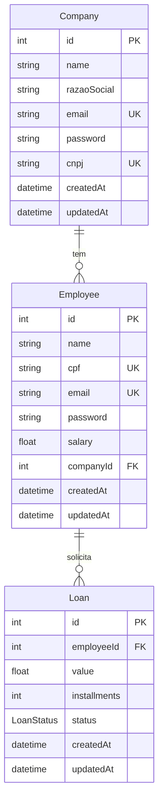
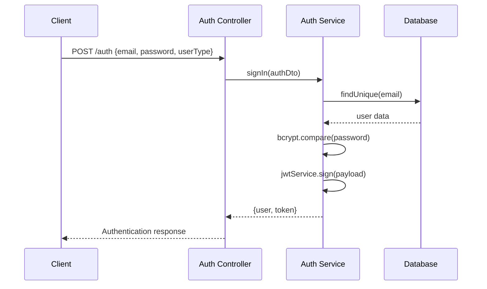
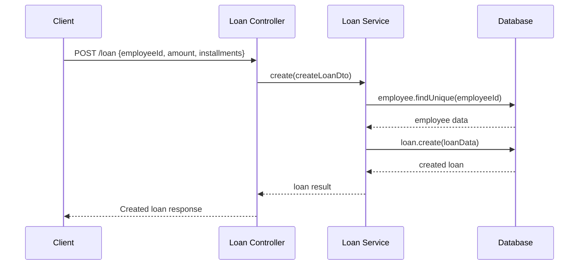

# 🏗️ Mapeamento Estrutural do Backend - Credifit

Este documento fornece um mapeamento completo da estrutura, funcionalidades e componentes do backend da aplicação Credifit.

## 📂 Estrutura do Projeto

### Arquitetura Geral
```
backend/
├── src/
│   ├── main.ts                 # Ponto de entrada da aplicação
│   ├── app.module.ts           # Módulo principal
│   ├── api/                    # Módulos de API
│   │   ├── auth/              # Autenticação
│   │   ├── company/           # Empresas
│   │   ├── employee/          # Funcionários
│   │   ├── loan/              # Empréstimos
│   │   └── analysis/          # Análise de crédito
│   └── prisma/                # Serviço de banco de dados
├── prisma/                     # Schema e migrações
├── test/                       # Testes E2E
└── dist/                       # Build de produção
```

### Tecnologias Utilizadas
- **Framework:** NestJS v11.0.1
- **ORM:** Prisma v6.11.1
- **Banco de Dados:** SQLite
- **Autenticação:** JWT (@nestjs/jwt)
- **Validação:** class-validator, class-transformer
- **Documentação:** Swagger/OpenAPI
- **Criptografia:** bcrypt
- **Testes:** Jest

## 🏛️ Arquitetura Modular

### App Module
**Arquivo:** `src/app.module.ts`

```typescript
@Module({
  imports: [
    PrismaModule,      // Conexão com banco de dados
    CompanyModule,     // Módulo de empresas
    EmployeeModule,    // Módulo de funcionários
    LoanModule,        // Módulo de empréstimos
    AnalysisModule,    // Módulo de análise
    AuthModule,        // Módulo de autenticação
  ],
})
```

### Bootstrap (main.ts)
**Arquivo:** `src/main.ts`

**Configurações:**
- **Porta:** 3000 (padrão)
- **Swagger:** `/api` endpoint
- **CORS:** Habilitado para todas as origens
- **Validation Pipe:** Global com whitelist
- **Documentação:** Swagger UI automático

## 📊 Modelo de Dados

### Schema Prisma
**Arquivo:** `prisma/schema.prisma`



### Enums
```typescript
enum LoanStatus {
  PAID       // Pago
  PENDING    // Pendente
  PROCESSING // Processando
  REJECTED   // Rejeitado
}
```

## 🔐 Sistema de Autenticação

### Auth Module
**Arquivos:** `src/api/auth/`

#### AuthController
**Endpoint:** `POST /auth`

**Funcionalidade:** Autenticação de usuários (empresas e funcionários)

**Request:**
```typescript
{
  email: string;
  password: string;
  userType: 'employee' | 'company';
}
```

**Response:**
```typescript
{
  user: {
    id: number;
    name: string;
    email: string;
    userType: string;
  };
  token: string; // JWT Token
}
```

#### AuthService
**Funcionalidades:**
- **signIn:** Autenticação com bcrypt
- **getCompany:** Busca empresa por email
- **getEmployee:** Busca funcionário por email
- **JWT:** Geração de token com payload

#### AuthGuard
**Funcionalidade:** Proteção de rotas com JWT

**Implementação:**
- Extrai token do header Authorization
- Verifica assinatura JWT
- Adiciona payload ao request como `request.user`
- Lança UnauthorizedException se inválido

## 🏢 Módulo de Empresas

### Company Module
**Arquivos:** `src/api/company/`

#### CompanyController
**Endpoints:**
- `POST /company` - Criar empresa
- `GET /company` - Listar empresas (protegida)
- `GET /company/:id` - Buscar empresa (protegida)
- `PATCH /company/:id` - Atualizar empresa (protegida)
- `DELETE /company/:id` - Remover empresa (protegida)

#### CompanyService
**Funcionalidades:**
- **create:** Criação com hash da senha e validação de CNPJ único
- **findAll:** Listagem sem senhas
- **findOne:** Busca por ID sem senha
- **update:** Atualização com hash opcional da senha
- **remove:** Remoção com verificação de existência

**Validações:**
- CNPJ único no sistema
- Hash de senha com bcrypt (saltRounds: 10)
- Exclusão da senha nas respostas

#### DTOs
- **CreateCompanyDto:** Validação de criação
- **UpdateCompanyDto:** Validação de atualização

## 👥 Módulo de Funcionários

### Employee Module
**Arquivos:** `src/api/employee/`

#### EmployeeController
**Endpoints:**
- `POST /employee` - Criar funcionário
- `GET /employee` - Listar funcionários (protegida)
- `GET /employee/:id` - Buscar funcionário (protegida)
- `GET /employee/loans/:id` - Listar empréstimos do funcionário (protegida)
- `PATCH /employee/:id` - Atualizar funcionário (protegida)
- `DELETE /employee/:id` - Remover funcionário (protegida)

#### EmployeeService
**Funcionalidades:**
- **create:** Criação com validação de CPF e empresa
- **findAll:** Listagem sem senhas
- **findOne:** Busca por ID sem senha
- **update:** Atualização com validação de CPF único
- **remove:** Remoção com verificação
- **employeeLoans:** Listagem de empréstimos do funcionário

**Validações:**
- CPF único no sistema
- Empresa deve existir (por CNPJ)
- Hash de senha com bcrypt (saltRounds: 10)
- Exclusão da senha nas respostas

#### DTOs
- **CreateEmployeeDto:** Validação com companyCnpj
- **UpdateEmployeeDto:** Validação de atualização

## 💰 Módulo de Empréstimos

### Loan Module
**Arquivos:** `src/api/loan/`

#### LoanController
**Endpoints:**
- `POST /loan` - Criar empréstimo (protegida)
- `GET /loan` - Listar empréstimos (protegida)
- `GET /loan/:id` - Buscar empréstimo (protegida)
- `PATCH /loan/:id` - Atualizar empréstimo (protegida)
- `DELETE /loan/:id` - Remover empréstimo (protegida)

#### LoanService
**Funcionalidades:**
- **create:** Criação com validação de funcionário
- **findAll:** Listagem com dados do funcionário
- **findOne:** Busca por ID com relacionamentos
- **update:** Atualização com verificação de existência
- **remove:** Remoção com verificação

**Relacionamentos:**
- Inclui dados do funcionário nas consultas
- Validação de existência do funcionário

#### DTOs
- **CreateLoanDto:** employeeId, amount, installments
- **UpdateLoanDto:** Campos opcionais para atualização

## 📈 Módulo de Análise

### Analysis Module
**Arquivos:** `src/api/analysis/`

#### AnalysisController
**Endpoints:**
- `POST /analysis` - Validar empréstimo

#### AnalysisService
**Funcionalidades:**
- **validateLoan:** Análise de score baseada no valor
- **findPayment:** Simulação de processamento de pagamento

**Regras de Score:**
```typescript
if (amount <= 2000) return { score: 400 };
if (amount <= 4000) return { score: 500 };
if (amount <= 8000) return { score: 600 };
if (amount <= 12000) return { score: 700 };
return { score: 0 };
```

**Simulação de Pagamento:**
- Timeout aleatório entre 1-20 segundos
- Status PAID se < 10 segundos
- Status PENDING se > 10 segundos
- Processamento em background

#### DTOs
- **ValidateAnalysisDto:** Validação de análise

## 🗄️ Serviço de Banco de Dados

### Prisma Module
**Arquivos:** `src/prisma/`

#### PrismaService
**Funcionalidade:** Extensão do PrismaClient com inicialização automática

```typescript
@Injectable()
export class PrismaService extends PrismaClient implements OnModuleInit {
  async onModuleInit() {
    await this.$connect();
  }
}
```

**Configuração:**
- **Provider:** SQLite
- **Conexão:** Automática na inicialização
- **Migrations:** Versionamento de schema
- **Client:** Geração automática

## 📝 Documentação API

### Swagger Configuration
**Configuração em main.ts:**
```typescript
const config = new DocumentBuilder()
  .setTitle('Credifit_API')
  .setDescription('API para simulação de empréstimos')
  .setVersion('1.0')
  .addServer(`http://localhost:3000`, 'Servidor Local')
  .build();
```

**Acesso:** `http://localhost:3000/api`

### Decorators Swagger
**Utilizados em todos os controllers:**
- `@ApiTags()` - Agrupamento de endpoints
- `@ApiOperation()` - Descrição da operação
- `@ApiResponse()` - Respostas possíveis
- `@ApiBearerAuth()` - Autenticação necessária

## 🔒 Segurança

### Autenticação JWT
**Configuração:**
- **Secret:** process.env.JWT_SECRET
- **Algoritmo:** HS256 (padrão)
- **Header:** Authorization: Bearer {token}

### Criptografia
**bcrypt:**
- **Salt Rounds:** 10
- **Uso:** Hash de senhas de empresas e funcionários

### Validação
**class-validator:**
- **Pipe Global:** ValidationPipe com whitelist
- **Transform:** Trim automático em strings
- **Sanitização:** Remoção de propriedades não permitidas

### CORS
**Configuração:**
- **Origin:** '*' (desenvolvimento)
- **Methods:** GET, POST, PATCH, DELETE, OPTIONS
- **Headers:** Content-Type, Authorization

## 📋 DTOs e Validações

### Padrão de DTOs
```typescript
export class CreateEntityDto {
  @ApiProperty()
  @IsString()
  @IsNotEmpty()
  @Transform(({ value }) => value?.trim())
  field: string;
}
```

### Validações Comuns
- **@IsString()** - Validação de string
- **@IsNotEmpty()** - Campo obrigatório
- **@IsEmail()** - Validação de email
- **@Transform()** - Transformação de dados
- **@ApiProperty()** - Documentação Swagger

## 🧪 Testes

### Estrutura de Testes
```
src/
├── **/*.spec.ts        # Testes unitários
test/
├── app.e2e-spec.ts     # Testes E2E
└── jest-e2e.json       # Configuração E2E
```

### Configuração Jest
**Arquivo:** `package.json`
```json
{
  "jest": {
    "moduleFileExtensions": ["js", "json", "ts"],
    "rootDir": "src",
    "testRegex": ".*\\.spec\\.ts$",
    "transform": { "^.+\\.(t|j)s$": "ts-jest" },
    "collectCoverageFrom": ["**/*.(t|j)s"],
    "coverageDirectory": "../coverage",
    "testEnvironment": "node"
  }
}
```

### Comandos de Teste
```bash
npm run test          # Testes unitários
npm run test:watch    # Testes em modo watch
npm run test:cov      # Cobertura de testes
npm run test:e2e      # Testes E2E
```

## 🚀 Deployment

### Build de Produção
```bash
npm run build         # Compila TypeScript
npm run start:prod    # Inicia aplicação
```

### Estrutura de Build
```
dist/
├── main.js           # Aplicação compilada
├── **/*.js           # Módulos compilados
└── **/*.d.ts         # Declarações TypeScript
```

### Variáveis de Ambiente
```env
DATABASE_URL="file:./dev.db"
JWT_SECRET="your-secret-key"
PORT=3000
```

## 📊 Performance e Monitoramento

### Logging
**Console logs para:**
- Inicialização da aplicação
- Erros de autenticação
- Operações de banco de dados
- Processamento de análises

### Otimizações
- **Prisma:** Consultas otimizadas com select específico
- **bcrypt:** Salt rounds balanceados (10)
- **JWT:** Payload mínimo
- **Validation:** Pipes globais eficientes

## 🔄 Fluxos de Negócio

### Fluxo de Autenticação


### Fluxo de Criação de Empréstimo


## 🛠️ Desenvolvimento

### Comandos Principais
```bash
# Desenvolvimento
npm run start:dev     # Modo watch
npm run start:debug   # Modo debug

# Build
npm run build         # Compilação

# Testes
npm run test          # Unitários
npm run test:e2e      # E2E

# Linting
npm run lint          # ESLint
npm run format        # Prettier

# Prisma
npx prisma migrate dev    # Migrações
npx prisma generate      # Gerar client
npx prisma studio        # Interface visual
```

### Estrutura de Desenvolvimento
```
src/api/[module]/
├── [module].controller.ts      # Endpoints HTTP
├── [module].service.ts         # Lógica de negócio
├── [module].module.ts          # Configuração do módulo
├── dto/                        # Data Transfer Objects
│   ├── create-[module].dto.ts
│   └── update-[module].dto.ts
├── entities/                   # Entidades para Swagger
│   └── [module].entity.ts
└── [module].controller.spec.ts # Testes unitários
```

## 🔧 Configurações

### ESLint
**Arquivo:** `eslint.config.mjs`
- **Extends:** @nestjs/eslint-config
- **Parser:** @typescript-eslint/parser
- **Rules:** Padrão NestJS

### TypeScript
**Arquivo:** `tsconfig.json`
- **Target:** ES2020
- **Module:** commonjs
- **Strict:** true
- **Decorators:** experimentalDecorators

### Nest CLI
**Arquivo:** `nest-cli.json`
- **Language:** ts
- **Collection:** @nestjs/schematics
- **Source Root:** src

## 📈 Métricas e Monitoramento

### Endpoints de Health
- **Swagger UI:** `/api` - Documentação interativa
- **Application:** `/` - Status da aplicação

### Logs Importantes
- **Bootstrap:** Inicialização da aplicação
- **Auth Errors:** Falhas de autenticação
- **Database:** Operações de banco
- **Analysis:** Processamento de análises

## 🔮 Possíveis Melhorias

### Segurança
1. **Rate Limiting:** Implementar throttling
2. **HTTPS:** Certificados SSL
3. **Environment Variables:** Configuração segura
4. **Input Sanitization:** Sanitização avançada

### Performance
1. **Database Indexing:** Índices otimizados
2. **Caching:** Redis para cache
3. **Connection Pooling:** Pool de conexões
4. **Query Optimization:** Consultas eficientes

### Monitoring
1. **Health Checks:** Endpoints de saúde
2. **Metrics:** Prometheus/Grafana
3. **Logging:** Structured logging
4. **Tracing:** OpenTelemetry

### Testing
1. **Unit Tests:** Cobertura completa
2. **Integration Tests:** Testes de integração
3. **E2E Tests:** Cenários completos
4. **Performance Tests:** Testes de carga

---

## 📚 Referências

- [NestJS Documentation](https://docs.nestjs.com)
- [Prisma Documentation](https://www.prisma.io/docs)
- [JWT Documentation](https://jwt.io)
- [Swagger/OpenAPI](https://swagger.io/specification/)
- [bcrypt Documentation](https://www.npmjs.com/package/bcrypt)