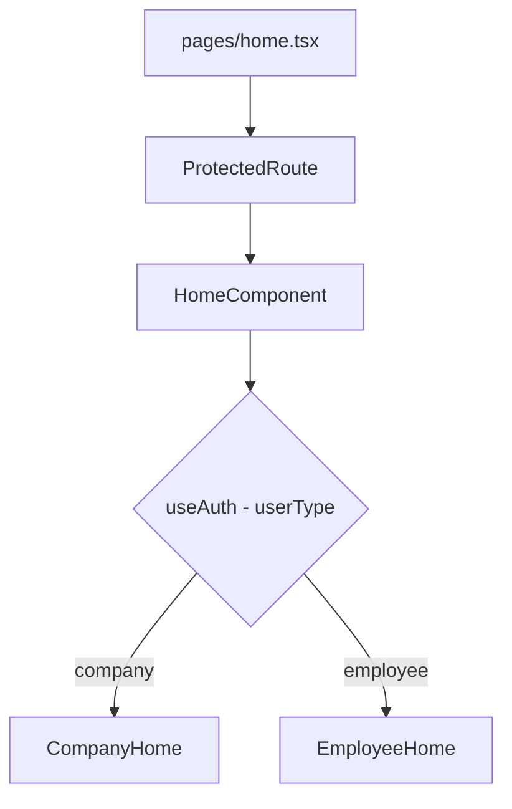
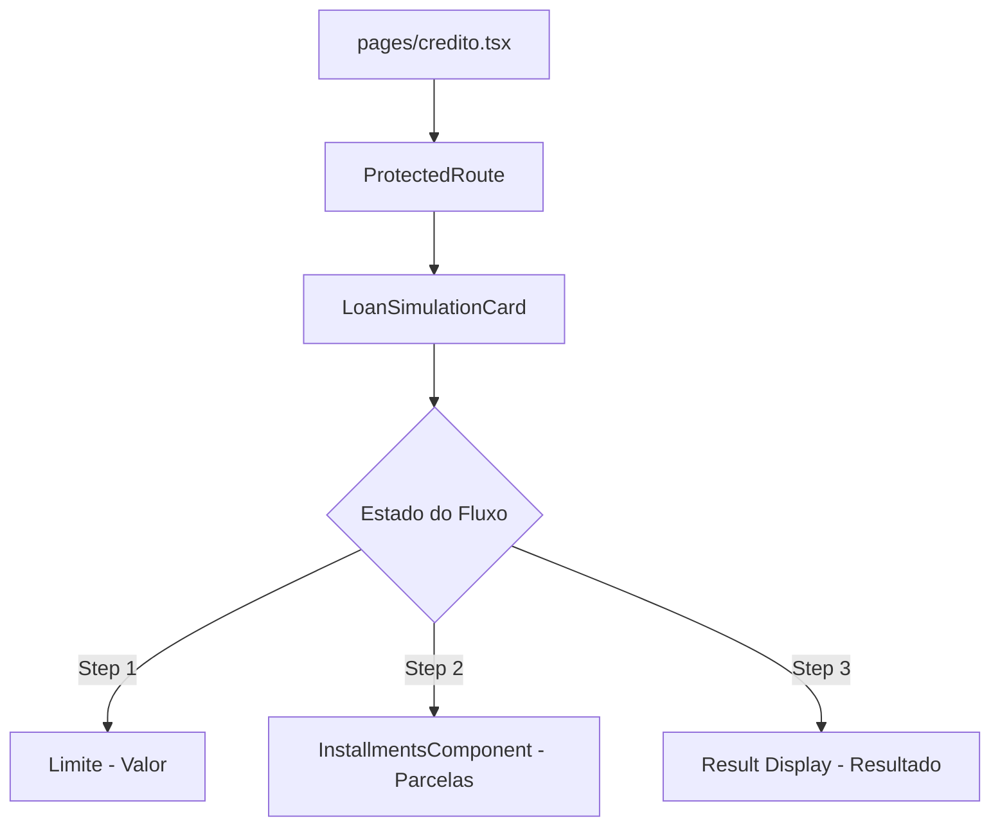
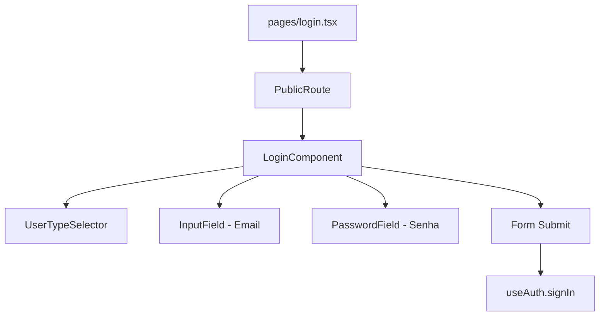
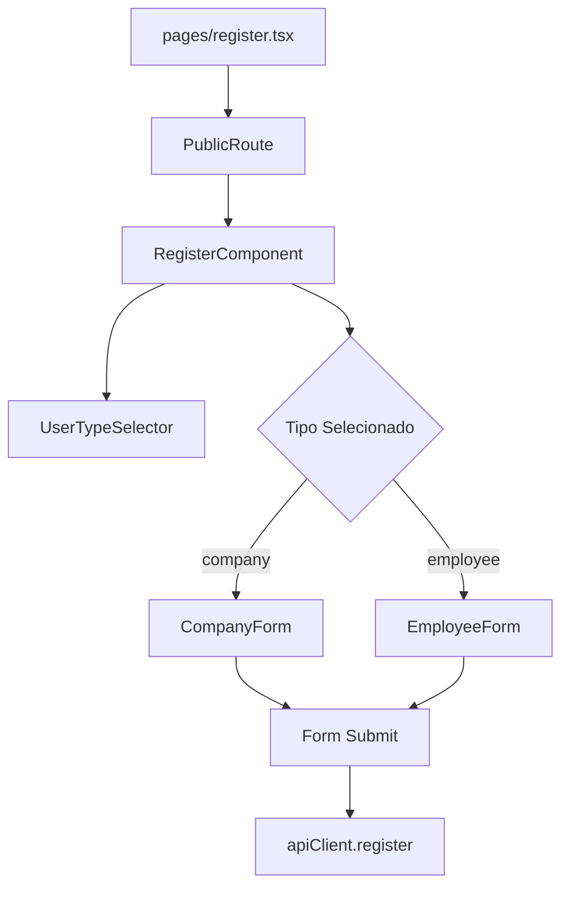
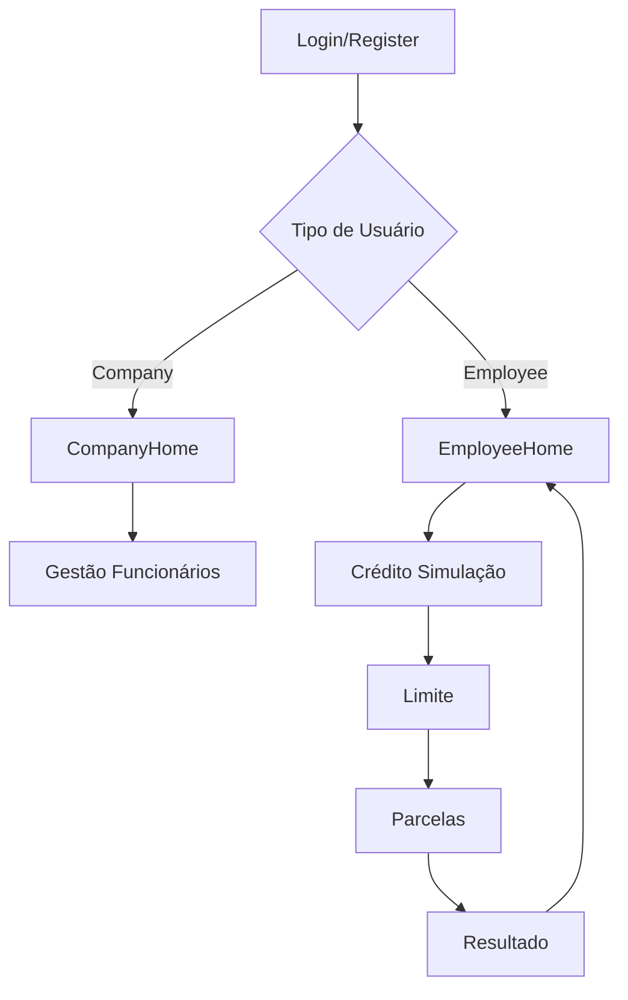

# 🎯 Mapeamento Estrutural do Frontend - Credifit

Este documento fornece um mapeamento completo da estrutura, funcionalidades e componentes do frontend da aplicação Credifit.

## 📂 Estrutura de Rotas

### Configuração de Rotas
```typescript
// frontend/app/routes.ts
export default [
  layout("layout.tsx", [
    index("pages/home.tsx"),           // Rota: "/"
    route("/credito", "pages/credito.tsx")  // Rota: "/credito"
  ]),
  route("/login", "pages/login.tsx"),      // Rota: "/login"
  route("/register", "pages/register.tsx") // Rota: "/register"
] satisfies RouteConfig;
```

## 🎯 Mapeamento Detalhado por Rota

### 1. 🏠 Rota: "/" (Home Dashboard)

**Arquivo:** `frontend/app/pages/home.tsx`

**Proteção:** `<ProtectedRoute>` - Requer autenticação

**Componente Principal:** `<HomeComponent />`

**Funcionalidade:** Dashboard condicional baseado no tipo de usuário

#### Fluxo de Componentes:


#### Subcomponentes:

##### **CompanyHome** (`components/CompanyHome.tsx`)
- **Funcionalidade:** Dashboard para empresas
- **Recursos:**
  - Lista funcionários com acordeão expansível
  - Mostra estatísticas de empréstimos por funcionário
  - Botão "Adicionar Funcionário"
- **Dependências:** `Accordion`, `FiChevronLeft`
- **Dados:** Mock de funcionários com empréstimos

##### **EmployeeHome** (`components/EmployeeHome.tsx`)
- **Funcionalidade:** Dashboard para funcionários
- **Recursos:**
  - Lista empréstimos do funcionário
  - Banner de notificação com avatar
  - Botão "Novo empréstimo" → navega para `/credito`
  - Status coloridos para empréstimos (aprovado/reprovado/em análise)
- **Dependências:** `Accordion`, `useAuth()`, `useNavigate()`, `FiCheckCircle`, `FiClock`
- **Dados:** Mock de empréstimos com status

---

### 2. 💳 Rota: "/credito" (Simulação de Empréstimo)

**Arquivo:** `frontend/app/pages/credito.tsx`

**Proteção:** `<ProtectedRoute>` - Requer autenticação

**Componente Principal:** `<LoanSimulationCard />`

**Funcionalidade:** Fluxo de simulação de empréstimo em 3 etapas

#### Fluxo de Componentes:


#### Subcomponentes:

##### **Limite** (`component/credito/limite/limite.tsx`)
- **Funcionalidade:** Seleção do valor do empréstimo
- **Recursos:**
  - Slider interativo (R$ 500 - R$ 50.000)
  - Input formatado em moeda brasileira
  - Valor padrão: R$ 10.000
  - Botões: "Voltar" e "Simular empréstimo"
- **Dependências:** `formatCurrency`, `useNavigate`

##### **InstallmentsComponent** (`component/credito/parcelas/index.tsx`)
- **Funcionalidade:** Seleção de parcelamento
- **Recursos:**
  - Opções: 1x, 2x, 3x, 4x
  - Cálculo automático do valor por parcela
  - Seleção visual com destaque
  - Botões: "Voltar" e "Seguinte"
- **Dependências:** `formatCurrency`

##### **Result Display** (dentro do LoanSimulationCard)
- **Funcionalidade:** Exibição do resultado da simulação
- **Recursos:**
  - Status do empréstimo (APROVADO/REPROVADO)
  - Valores solicitados e parcelas
  - Opção para simular novamente

---

### 3. 🔐 Rota: "/login" (Autenticação)

**Arquivo:** `frontend/app/pages/login.tsx`

**Proteção:** `<PublicRoute>` - Redireciona se já autenticado

**Componente Principal:** `<LoginComponent />`

**Funcionalidade:** Autenticação de usuários (empresas e funcionários)

#### Fluxo de Componentes:


#### Subcomponentes:

##### **UserTypeSelector**
- **Funcionalidade:** Seleção entre Empresa e Funcionário
- **UI:** Radio buttons estilizados

##### **InputField**
- **Funcionalidade:** Campo de entrada reutilizável
- **Recursos:** Validação, placeholder, erro feedback

##### **PasswordField**
- **Funcionalidade:** Campo de senha com visibilidade toggleável
- **Recursos:** Ícones Eye/EyeOff, toggle de visibilidade

#### Validação:
- **Schema Zod:** Validação de email, senha (min 6 chars), userType
- **Feedback:** Toasts de sucesso/erro
- **Redirecionamento:** Para "/" após login bem-sucedido

---

### 4. 📝 Rota: "/register" (Cadastro)

**Arquivo:** `frontend/app/pages/register.tsx`

**Proteção:** `<PublicRoute>` - Redireciona se já autenticado

**Componente Principal:** `<RegisterComponent />`

**Funcionalidade:** Cadastro de empresas e funcionários

#### Fluxo de Componentes:


#### Formulários:

##### **CompanyForm** (empresa)
- **Campos:** Nome, Razão Social, CNPJ, Email, Senha, Confirmar Senha
- **Validação:** CNPJ (14 dígitos), email, senhas coincidentes
- **Formatação:** CNPJ automático (00.000.000/0000-00)

##### **EmployeeForm** (funcionário)
- **Campos:** Nome, CPF, Email, Senha, Confirmar Senha, Salário, CNPJ da Empresa
- **Validação:** CPF (11 dígitos), salário numérico, CNPJ da empresa
- **Formatação:** CPF automático (000.000.000-00)

#### Recursos:
- **Validação em tempo real:** CPF/CNPJ, email, senhas
- **Formatação automática:** Documentos brasileiros
- **Feedback:** Toasts de sucesso/erro
- **Redirecionamento:** Para "/login" após cadastro

---

## 🔧 Componentes Globais

### Layout Principal
**Arquivo:** `frontend/app/layout.tsx`

```typescript
export default function Layout() {
  return (
    <>
      <Toaster position="top-right" />
      <div className="w-full h-full flex flex-col">
        <HeaderComponent />
        <main className="flex pt-5 align-center justify-center overflow-y-auto">
          <Outlet />
        </main>
      </div>
    </>
  );
}
```

**Componentes:**
- **HeaderComponent:** Navegação superior
- **Outlet:** Renderização de rotas filhas
- **Toaster:** Notificações globais

### Header
**Arquivo:** `frontend/app/component/header/header.tsx`

**Funcionalidade:** Navegação superior com informações do usuário

**Elementos:**
- Logo da Credifit
- Nome do usuário logado
- Avatar/ícone do usuário
- Dropdown menu com logout

**Dependências:** `useAuth()`, `DropdownMenu`

### Dropdown Menu
**Arquivo:** `frontend/app/component/dropdown/DropdownMenu.tsx`

**Funcionalidade:** Menu suspenso com opções do usuário

**Recursos:**
- Toggle de visibilidade
- Opção de logout
- Estilo customizado com CSS

**Dependências:** `useAuth()`, `IoIosArrowDown`

---

## 🛡️ Guards de Autenticação

### ProtectedRoute
**Arquivo:** `frontend/app/components/auth/ProtectedRoute.tsx`

**Funcionalidade:** Protege rotas que requerem autenticação

**Comportamento:**
- Verifica `isAuthenticated` do AuthContext
- Exibe loading durante verificação
- Redireciona para "/login" se não autenticado
- Renderiza conteúdo protegido se autenticado

### PublicRoute
**Arquivo:** `frontend/app/components/auth/PublicRoute.tsx`

**Funcionalidade:** Protege rotas públicas (login/register)

**Comportamento:**
- Verifica `isAuthenticated` do AuthContext
- Exibe loading durante verificação
- Redireciona para "/" se já autenticado
- Renderiza conteúdo público se não autenticado

---

## 🔄 Componentes Reutilizáveis

### Accordion
**Arquivo:** `frontend/app/components/common/Accordion.tsx`

**Funcionalidade:** Componente expansível reutilizável

**Props:**
- `title`: Conteúdo do cabeçalho
- `children`: Conteúdo expansível

**Uso:**
- CompanyHome: Lista de funcionários
- EmployeeHome: Lista de empréstimos

**Recursos:**
- Estado interno de abertura/fechamento
- Ícones de expansão (ChevronDown/ChevronUp)
- Animação suave

---

## 🔗 Dependências e Integrações

### Contexto de Autenticação
**Arquivo:** `frontend/app/context/auth/AuthContext.tsx`

**Estado Global:**
```typescript
interface AuthContextType {
  isAuthenticated: boolean;
  user: User | null;
  loan: Loan | null;
  signIn: (data: any) => Promise<void>;
  signOut: () => void;
  loading: boolean;
}
```

**Funcionalidades:**
- **Login:** Autenticação com JWT
- **Logout:** Limpeza de sessão
- **Verificação de sessão:** Inicialização automática
- **Persistência:** localStorage para token e usuário

### Hook useAuth
**Arquivo:** `frontend/app/hook/useAuth.tsx`

**Funcionalidade:** Hook para acesso ao contexto de autenticação

**Uso:** Consumido por todos os componentes que precisam de informações do usuário

### API Client
**Arquivo:** `frontend/app/api/index.ts`

**Métodos Disponíveis:**
- `auth.login(email, password, userType)`
- `auth.logout()`
- `auth.me(userId, userType)`
- `register(userData)`
- `getLoans(employeeId)`
- `createLoan(loanData)`

**Base:** Axios com interceptors para autenticação

### Utilitários

#### FormatCurrency
**Arquivo:** `frontend/app/functions/FormatCurrency.ts`

**Funcionalidade:** Formatação de valores monetários em Real brasileiro

**Uso:** Componentes de simulação de empréstimo

#### Types
**Arquivos:** 
- `frontend/app/types/index.ts`
- `frontend/app/types/register.d.ts`

**Funcionalidade:** Tipagens TypeScript para toda a aplicação

---

## 🎨 Padrões de Design

### Estilização
**Framework:** TailwindCSS v4.1.4

**Cores Principais:**
- **Primary:** `#057D88` (Teal)
- **Secondary:** `#FFD899` (Orange)
- **Success:** Verde padrão
- **Error:** Vermelho padrão

**Componentes de UI:**
- Cards com shadow e rounded corners
- Botões arredondados com hover effects
- Inputs com focus rings
- Loading spinners animados

### Responsividade
- **Mobile-first:** Design adaptável
- **Breakpoints:** sm, md, lg, xl, 2xl
- **Containers:** max-width com centralização

### Fluxo de Navegação



### Estados de Loading
- **Autenticação:** Spinners durante verificação
- **Formulários:** Estados disabled durante submit
- **Simulação:** Feedback "Analisando solicitação..."
- **Feedback:** react-hot-toast para sucesso/erro

---

## 📱 Recursos de UX

### Feedback Visual
- **Toasts:** Notificações de sucesso/erro
- **Loading States:** Indicadores de carregamento
- **Form Validation:** Feedback em tempo real
- **Hover Effects:** Transições suaves

### Acessibilidade
- **Semantic HTML:** Estrutura semântica
- **ARIA Labels:** Acessibilidade para screen readers
- **Keyboard Navigation:** Navegação por teclado
- **Focus Management:** Estados de foco visíveis

### Performance
- **Lazy Loading:** Componentes carregados sob demanda
- **Memoização:** Otimização de re-renders
- **Code Splitting:** Separação de código por rotas
- **Cache:** localStorage para dados do usuário

---

## 🔧 Desenvolvimento

### Comandos Principais
```bash
# Desenvolvimento
npm run dev

# Build
npm run build

# Typecheck
npm run typecheck

# Produção
npm run start
```

### Estrutura de Pastas
```
frontend/app/
├── api/                    # Cliente API
├── component/              # Componentes específicos
├── components/             # Componentes reutilizáveis
├── context/               # Contextos React
├── functions/             # Utilitários
├── hook/                  # Custom hooks
├── pages/                 # Páginas/rotas
├── types/                 # Tipagens TypeScript
├── layout.tsx             # Layout principal
├── root.tsx               # Raiz da aplicação
└── routes.ts              # Configuração de rotas
```

### Tecnologias Utilizadas
- **React Router v7:** Roteamento
- **React Hook Form:** Formulários
- **Zod:** Validação de esquemas
- **Axios:** Cliente HTTP
- **React Hot Toast:** Notificações
- **Lucide React:** Ícones
- **TailwindCSS:** Estilização

---

## 🚀 Próximos Passos

### Melhorias Sugeridas
1. **Testes:** Implementar testes unitários e de integração
2. **Storybook:** Documentação visual de componentes
3. **PWA:** Transformar em Progressive Web App
4. **Internacionalização:** Suporte a múltiplos idiomas
5. **Dark Mode:** Tema escuro
6. **Real-time:** WebSocket para notificações

### Otimizações
1. **Bundle Size:** Análise e otimização
2. **Performance:** Lazy loading aprimorado
3. **SEO:** Meta tags e estrutura otimizada
4. **Monitoring:** Integração com ferramentas de monitoramento